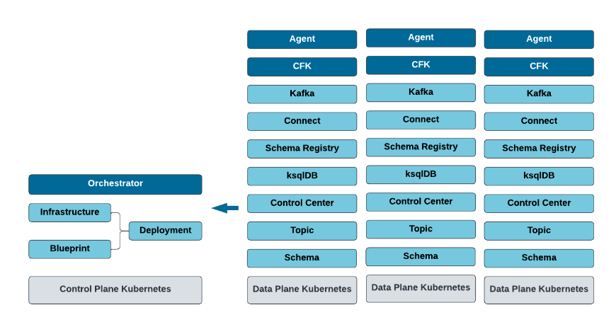

# CFK Blueprints

We will create a Kafka cluster using CFK Blueprints. We will use only one k8s cluster, but
it is also possible to use CFK Blueprints across multiple k8s clusters. 



## Requirements
* CFK ≥ 2.4
* CP ≥ 7.4

## Useful Resources
* [Documentation Overview](https://docs.confluent.io/operator/current/blueprints/cob-overview.html)
* [Installation Guide](https://docs.confluent.io/operator/current/blueprints/cob-install.html#cob-install-local-agent)
* [Example Repository](https://github.com/confluentinc/confluent-kubernetes-examples/blob/master/blueprints/quickstart-deploy/single-site-deployment.rst)

## Kubernetes Setup

Start k8s cluster

```shell
minikube start --cpus=6 --disk-size='100gb' --memory=max
```

Create two namespaces
```shell
kubectl create namespace control-plane
kubectl create namespace data-plane
```

## Set up Control Plane

In order to apply blueprints on the data plane later, we first need to set up
* the Orchestrator
* the Blueprint

### Orchestrator

The Orchestrator controls the entire flow (health check, CFK deployments, ...)

Install Confluent Orchestrator
```shell
helm upgrade --install confluent-orchestrator confluentinc/cfk-blueprint \
  --set orchestrator.enabled=true \
  --namespace control-plane
```

### Blueprint

Use a ConfluentPlatformBlueprint CR to standardize how Confluent should be deployed across your organization.
Blueprint references Confluent component classes CRs that represent corresponding Confluent components.

Any changes in the `ClusterClass CRs` or the `ConfluentPlatformBlueprint CR` are cluster wide and impact every clusters deployed with the Blueprint.
When your Blueprint or Confluent Platform classes change, CFK Blueprints will automatically detect the changes and roll the cluster if needed.

We define a standard Kafka cluster (ZK, Kafka, SR, C3) and blueprint

```shell
kubectl apply -f ./control-plane/CPBlueprint.yml -n control-plane
```

## Set up Data Plane
We now want to set up the corresponding CRDs to deploy finally a Kafka cluster in the data-plane namespace (this could also be a different k8s cluster).
We will deploy
* the Agent
* Kubernetes CR (--> in the control plane)
* Health Check CR (--> in the control plane)
* CFK Operator


### Agent

The agent 
* pulls the CP resources from the orchestrator
* sends the health probe to the orchestrator

Install Confluent Agent
```shell
helm upgrade --install confluent-agent confluentinc/cfk-blueprint \
 --set agent.mode=Local \
 --set agent.enabled=true \
 --namespace data-plane
```

### KubernetesCluster CR

A KubernetesCluster CR is an immutable representation of a Data Plane Kubernetes cluster.
It contains a unique cluster ID, information about regions and zones of a Data Plane cluster.

We need to deploy it in the control plane. To do so, we first need to get the k8s cluster ID from the data-plane cluster

Get the k8s cluster id
```shell
kubectl get namespace kube-system -oyaml | grep uid
```
Add the `uid` into the `./control-plane/KubernetesCluster.yml` and
deploy the KubernetesCluster CR (--> control plane)
```shell
kubectl apply -f ./control-plane/KubernetesCluster.yml -n control-plane
```

### HealthCheck CR

CPCHealthCheck periodically receives probes from all registered Agents about their availability

Deploy the CPCHealthCheck (--> control plane)
```shell
kubectl apply -f ./control-plane/CPCHealthCheck.yml -n control-plane
```
We verify that the Agent is up and running
```shell
kubectl get cpcHealthCheck -n control-plane


NAME            AGENT-MODE   AGENT-STATE   AGE
data-plane-hc   Local        Running       5m24s
```

### CFK Operator

We need to deploy the CFK operator as always
```shell
helm upgrade --install confluent-operator confluentinc/confluent-for-kubernetes \
  --set namespaced="false" \
  --namespace data-plane
```

## Deploy Kafka Cluster

We deploy the actual cluster based on the Blueprint

```shell
kubectl apply -f ./data-plane/Cluster.yml -n data-plane
```

## Play around with Blueprints
We can now modify the `./control-plane/CPBlueprint.yml` and the changes will automatically apply on the Kafka cluster.

### Change Auto Topic Creation

```shell
kubectl exec -it kafka-0 /bin/bash -n data-plane
```

We produce data into the topic `test` which does not exist

```shell
kafka-console-producer --bootstrap-server localhost:9092 --topic test
>message1
[2023-06-24 10:07:37,877] WARN [Producer clientId=console-producer] Error while fetching metadata with correlation id 4 : {test=UNKNOWN_TOPIC_OR_PARTITION} (org.apache.kafka.clients.NetworkClient)
[2023-06-24 10:07:37,977] WARN [Producer clientId=console-producer] Error while fetching metadata with correlation id 5 : {test=UNKNOWN_TOPIC_OR_PARTITION} (org.apache.kafka.clients.NetworkClient)
```
It does not work.
We change the corresponding config in blueprints

```yaml
configOverrides:
  server:
    - auto.create.topics.enable=true
```

and re-deploy it
```shell
kubectl apply -f ./control-plane/CPBlueprint.yml -n control-plane
```

We produce again to the non-existing topic `test`. It is created automatically.
We can consume and check it in C3
```shell
kubectl port-forward controlcenter-0 9021:9021 -n data-plane
```